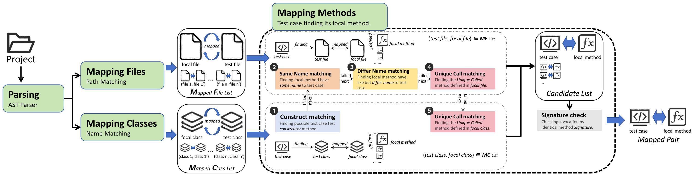

# COACH
**COACH (COmbine trACe Heuristics)**, a automated approach for establishing test-to-code traceability links and extracting pairs of test cases and corresponding focal methods. 


## COACH Guide
### Environment
To use COACH for extraction successfully, ensure that the following environment requirement is met:
- JDK version = 21.0.1
- Maven = 3.9.5

### Code Execution
To extract pairs from a project, follow these steps:
1. Navigate to the `./COACH` directory.
2. Build and run COACH.
   - `mvn clean install`
   - `mvn spring-boot:run`
   
3. Send a POST request to `http://localhost:8086/v1/iCode/extract`, here is an example:
```bash
{
    "projectPath":"/path/to/extrated/project/",
    "resultPath":"/path/to/save/result/",
    "repoId":"123",                              # unique ID
    "repoName":"ProjectName",
    "repoUrl": "http://url/to/your/project"      # optional
}
```
